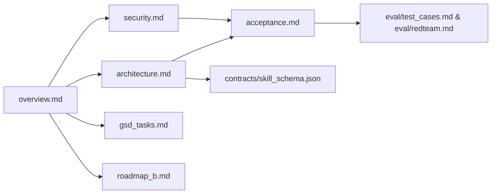
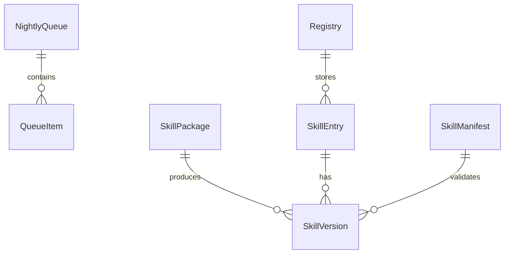

# Spec Architecture Report

> 说明：本报告依据仓库文件进行审计，关键结论均引用文件路径与片段。若涉及本地未纳入 git 的文件，会明确标注。

## 1) 规范类型识别
- **Markdown 规格文档**：`spec/overview.md`, `spec/architecture.md`, `spec/security.md`, `spec/acceptance.md`, `spec/gsd_tasks.md`, `spec/iteration.md`, `spec/roadmap_b.md`, `spec/eval/test_cases.md`, `spec/eval/redteam.md`, `spec/changes/TEMPLATE.md`, `spec/README.md`。
- **JSON Schema**：`spec/contracts/skill_schema.json`（含 `$schema: http://json-schema.org/draft-07/schema#` 与 `$id`）。
- **未发现** OpenAPI/Swagger/AsyncAPI/Proto/GraphQL 相关文件（`find` 无结果；详见 `reports/repo_profile.md`）。

## 2) 版本化策略现状
- 规范文档头部统一标注版本与更新时间，例如：
  - `spec/overview.md` 顶部声明 `版本：2.0.0 | 最后更新：2026-02-03`。
  - `spec/architecture.md`, `spec/security.md`, `spec/acceptance.md`, `spec/iteration.md` 等同样声明 `2.0.0`。
- 规范变更流程：
  - `spec/iteration.md` 要求“遇到问题先更新 spec”，并在文件顶部维护 Changelog，以及在 `spec/changes/NNN-*.md` 记录变更。
- 发布与版本控制提示：
  - `spec/gsd_tasks.md` 中给出 `git tag v2.0.0-project-a` 的里程碑标记建议。
- **版本口径**：
  - 代码与规范已统一为 `2.0.0`，需在后续发布中保持同步。

## 3) 契约边界（模块/目录 → 职责 → 对外契约 → 依赖）
依据 `spec/architecture.md` 的模块划分与接口说明：

- **Day Mode**（`src/day_logger.py`）
  - 职责：解析运行日志，提取 `[MISSING: ...]` 写入队列。
  - 对外契约：CLI `python -m src.day_logger --log --out`。
  - 依赖：`models/queue`（由规范示例推断）。

- **Night Mode**（`src/night_evolver.py`）
  - 职责：读队列、调用 LLM 生成、AST Gate、Sandbox 验证、入 staging、更新 registry。
  - 对外契约：CLI `python -m src.night_evolver --queue --staging --registry --provider`。
  - 依赖：`src/llm`, `src/security`, `src/sandbox`, `src/registry`。

- **Security**（`src/security/ast_gate.py`, `src/security/policy.py`）
  - 职责：静态安全检查；白名单/黑名单策略。
  - 对外契约：`ASTGate.check(code)` 返回 `(passed, violations)`（见 `spec/architecture.md` 框架）。

- **Sandbox**（`src/sandbox/runner.py`, `src/sandbox/harness.py`）
  - 职责：Docker 受限执行 `verify()` 与 pytest；超时与隔离策略。
  - 对外契约：`SandboxRunner`（见 `spec/architecture.md` 的职责描述）。

- **Promotion**（`src/promote.py`）
  - 职责：评测 gate（replay/regression/redteam），通过后晋升 prod。
  - 对外契约：CLI `python -m src.promote --staging --prod --registry --eval-dir`。

- **Rollback**（`src/rollback.py`）
  - 职责：切换 prod 指针回到指定版本。
  - 对外契约：CLI `python -m src.rollback --skill --to --registry`。

- **Registry**（`src/registry.py` + `src/models/registry.py`）
  - 职责：记录技能版本、状态、hash、验证结果。
  - 对外契约：`Registry.load/save/add_staging/promote/rollback`（见 `spec/architecture.md` 示例）。

- **Contract**（`spec/contracts/skill_schema.json`）
  - 职责：定义 `skill.json` 的结构与字段约束。
  - 对外契约：Schema Draft-07。

## 4) 引用关系图（$ref/import/include/链接）
### 4.1 Markdown 交叉引用
- `spec/README.md` 提供文档依赖关系图，且多处引用其他文档（如 `overview.md` 引用 `roadmap_b.md`；`iteration.md` 引用 `security.md` / `gsd_tasks.md` / `acceptance.md` / `eval/*`）。
- `spec/changes/TEMPLATE.md` 中列出影响范围清单（多文档引用）。

### 4.2 $ref / include
- `spec/contracts/skill_schema.json` 中未发现 `$ref`。

### 4.3 依赖拓扑（Mermaid）

## 5) 核心数据模型 / 实体清单（定义 → 关键字段 → 引用）
- **Skill Manifest**（`spec/contracts/skill_schema.json`）
  - 关键字段：`name`, `version`, `description`, `inputs_schema`, `outputs_schema`, `permissions`, `dependencies`, `tags`, `examples`。
  - 约束：`name` 必须符合 `^[a-z][a-z0-9_]{2,63}$`，`version` 为 `major.minor.patch`。

- **QueueItem / NightlyQueue**（`spec/architecture.md` 中示例）
  - 关键字段：`id`, `capability`, `first_seen`, `occurrences`, `context`, `status`。

- **SkillPackage / LLMProvider**（`spec/architecture.md`）
  - 关键字段：`name`, `code`, `manifest`, `tests`。
  - 作用：Night Mode 生成技能包接口。

- **Registry**（`spec/architecture.md`）
  - `SkillVersion`: `version`, `code_hash`, `manifest_hash`, `created_at`, `status`, `validation_result`。
  - `SkillEntry`: `name`, `current_prod`, `current_staging`, `versions`。
  - `Registry`: `load/save/add_staging/promote/rollback`。

### 核心实体关系图（Mermaid）

## 6) 风险与不一致点（证据）
- **规范描述与实际代码不一致**：
  - `spec/architecture.md` 与 `spec/roadmap_b.md` 引用 `src/skill_loader.py`，但 `src/` 实际不存在该文件（`ls src` 仅含 `day_logger.py`, `night_evolver.py` 等）。
- **规范描述的内置技能缺失**：
  - `spec/architecture.md` 描述 `skills/text_echo/` 作为内置技能，但 `skills/` 目录目前仅有 `.gitkeep`（`find skills/ -maxdepth 2` 结果）。
- **版本一致性维护**：
  - 当前版本已统一为 `2.0.0`，后续需在 `spec/*` 与 `pyproject.toml` 中同步更新。
